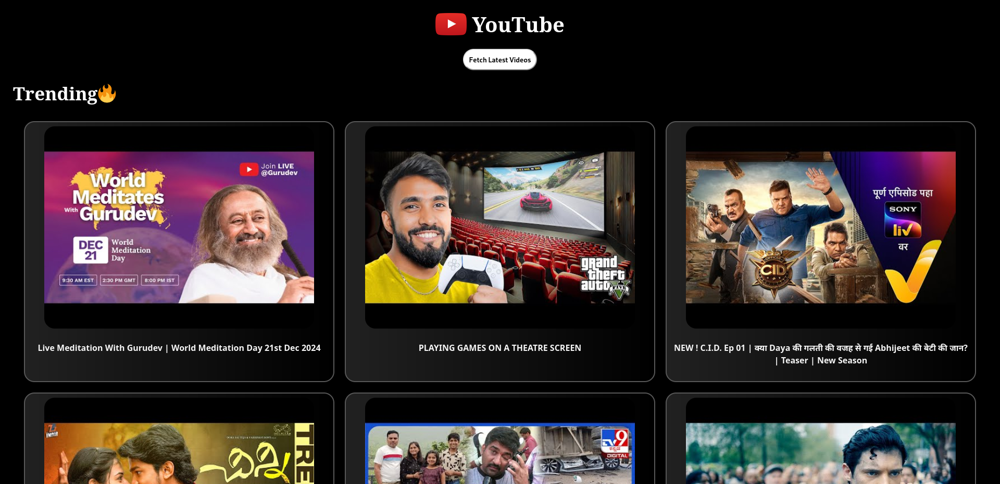
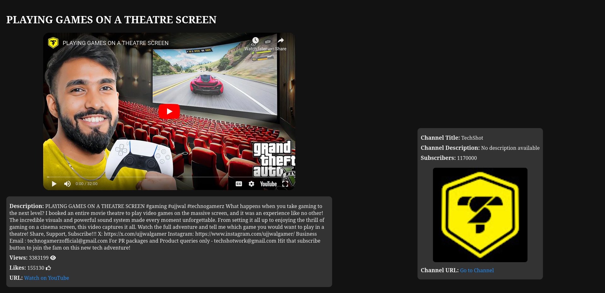
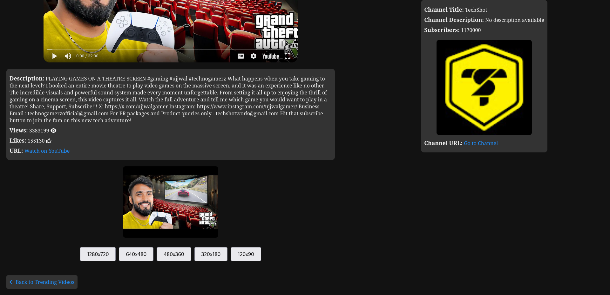
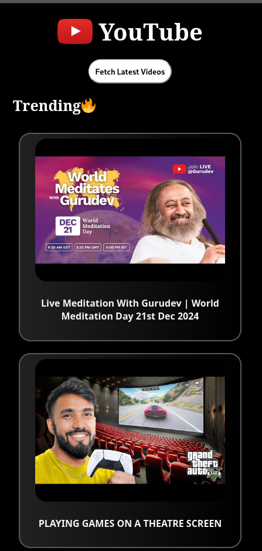
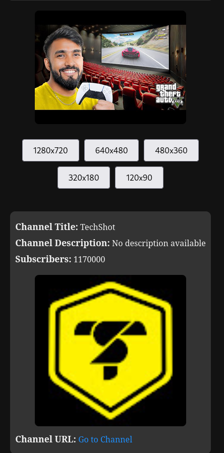

# YouTube Trending Video Scraper Web App
### LIVE SITE [HERE](http://youtube-trending-videos.infinityfreeapp.com/)
## Project Description

This application scrapes trending videos from YouTube, saves them into a database, and displays them on a web page. It includes:

- **API Endpoints**: Fetch, store, and retrieve video data.
- **Landing Page**: List of trending videos.
- **Details Page**: Full video details with embedded video autoplay.

---

## Features

### API Endpoints

1. Retrieve trending videos from YouTube and save them to the database.
2. List all stored videos.
3. Fetch details of a specific video.

### Frontend

1. Landing page with a list of videos.
2. Details page showing full video information and embedded playback.

---

## Tech Stack

- **Backend**: Node.js, Express.js
- **Database**: MongoDB
- **Frontend**: HTML, CSS, PHP
- **Deployment**: Linux environment (Optional Dockerized setup).

---

## Installation Instructions

### Prerequisites

Ensure the following tools are installed:

- **Node.js**: [Download Node.js](https://nodejs.org)
- **MongoDB**: [Install MongoDB](https://www.mongodb.com)
- **PHP**: Install PHP on your system.
- **Linux Environment**: Ubuntu/Debian (recommended).

---

### 1. Clone the Repository

```bash
git clone https://github.com/aviraljain19/youtube_trending_scrapper.git
cd youtube-trending-scrapper
```

### 2. Setup Backend

#### 1. Install dependencies:

```bash
cd app
npm install
```

#### 2. Configure MongoDB:

- Start MongoDB locally.
- Update database URL in a .env file:

```bash
MONGODB_URI=mongodb://localhost:27017/youtube-videos
```
#### 3. Configure Youtube API:

- Create google cloud console account.
- Activate Youtube API V3 and generate key.
- Update API_KEY in a .env file:

```bash
API_KEY=key
```

#### 4. Run the server:

```bash
npm start
```

### 3. Setup Frontend

1. Ensure PHP is installed and running.

2. Update API URLs in the PHP files (index.php, fetch.php and details.php).

3. Start the PHP server:

```bash
cd frontend
php -S localhost:8080
```

### 4. Testing the Application

- Visit the landing page: http://localhost:8080
- To fetch new trending videos, click the Fetch Videos button.
- Click on a video to view its details.

### 5. Running the Application in Linux

To run the application on Linux:(I am using Fedora you can change the commands accordingly)

1. Install Node.js, PHP, and MongoDB:

```bash
sudo dnf install nodejs npm mongodb php php-cli
```

2. Clone the repository and follow the installation instructions.


3. Run the Node.js server and PHP server.
4. 
   

### 6. Screenshots
- Desktop view
 <p>
    
    
    
</p>

- Mobile view
  <p>
    
    
    
</p>


### 7. Contributing

Feel free to submit issues or pull requests for improvements.
